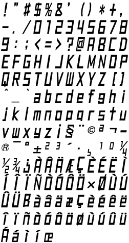

# JSRF Dialog Font
Generate vector typeface formats from extracted textures of the JSRF standard dialog font raster

The in-game source texture is:

and after autotracing each glyph sprite and compiling into a typeface, any arbitrary text can be rendered in this typeface:

## Building

### Dependencies
* potrace &mdash; raster to vector autotracer
* fontforge (including python module) &mdash; general purpose font creation suite 
* GNU Make

On Arch, these can be easily installed via `pacman`:
* `pacman --sync --refresh make potrace fontforge`
