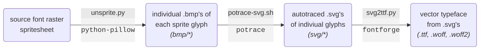

# JSRF Dialog Font

<div align="center">
<h3>
<span>

&nbsp;&nbsp;&nbsp;&nbsp;&nbsp;&nbsp;:arrow_right:&nbsp;&nbsp;&nbsp;&nbsp;&nbsp;&nbsp;

</span>
</h3>
</div>
<br/>

## Download

This repository code is provided to allow others to regenerate the font from scratch, or make whatever adjustments during the build that are preferred. The fonts as generated by the current state of this repository's code can be found in this repository's releases or linked here directly:

* [jsrf.ttf](/jsrf-tool/jsrf-dialog-font/releases/latest/download/jsrf.ttf)
* [jsrf.woff](/jsrf-tool/jsrf-dialog-font/releases/latest/download/jsrf.woff)
* [jsrf.woff2](/jsrf-tool/jsrf-dialog-font/releases/latest/download/jsrf.woff2)

## Installation & Usage

### Operating System
For use within the operating system, most operating systems support clicking on a .ttf to install it to the system fonts. If not, certainly an internet search for instructions on how to do so that target your operating system will be fruitful.

### CSS
```css
@font-face {
  font-family: "jsrf";
  src: url(path/to/jsrf.woff2) format("woff2"),
       url(path/to/jsrf.woff)  format("woff"),
       url(path/to/jsrf.ttf)   format("truetype");
}

/* ... */

.my-class {
    font-family: jsrf;
}
```


## Building

### Dependencies
* python-pillow &mdash; python image manipulation library
* potrace &mdash; raster to vector autotracer
* fontforge (including python module) &mdash; general purpose font creation suite 
* GNU Make

On Arch, these can be easily installed via `pacman`:
* `pacman --sync --refresh make potrace fontforge python-pillow`

### Pipeline

Data processing pipeline as executed by the `Makefile` to convert the font spritesheet to a vector typeface:


### Executing

Most simply, run `make` in this repository to execute each intermediate build step, culminating in the output fonts.

Or more specifically, `make bmp`, `make svg`, and then `make font` will manually invoke the process. `make clean` can be ran to remove any build artifacts.

The intermediate scripts `unsprite.py`, `potrace-svg.sh`, and `svg2ttf.py` should be straightforward enough to modify to the user's liking. Given the configuration of the code as it is in this repository, one of each font type `.ttf`, `.woff`, and `.woff2` will be generated.
