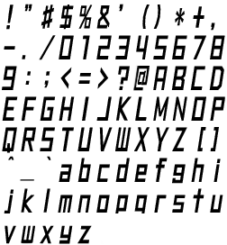
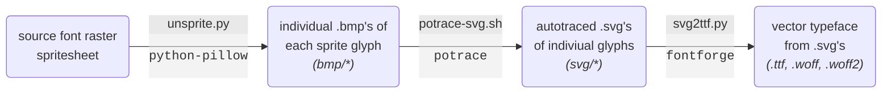

# JSRF Dialog Font

<h1>

&nbsp;&nbsp;&nbsp;&nbsp;&nbsp;&nbsp;:arrow_right:&nbsp;&nbsp;&nbsp;&nbsp;&nbsp;&nbsp;

</h1>

 

## Building

### Dependencies
* python-pillow &mdash; python image manipulation library
* potrace &mdash; raster to vector autotracer
* fontforge (including python module) &mdash; general purpose font creation suite 
* GNU Make

On Arch, these can be easily installed via `pacman`:
* `pacman --sync --refresh make potrace fontforge python-pillow`

### Pipeline

Data processing pipeline as executed by the `Makefile` to convert the font spritesheet to a vector typeface:

